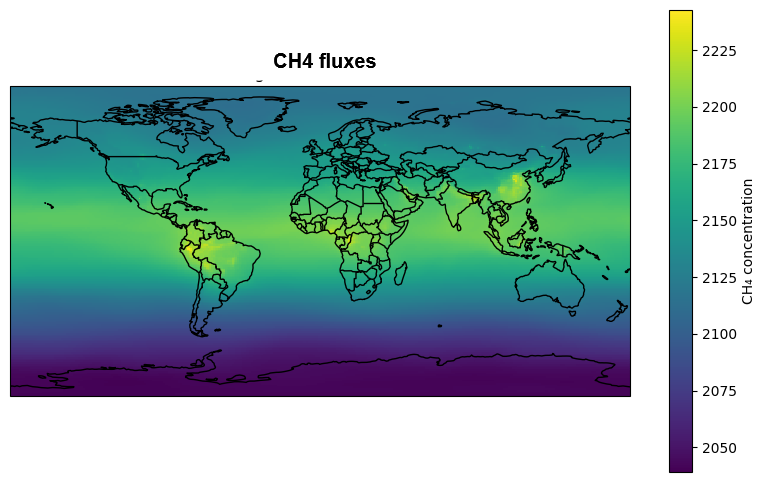
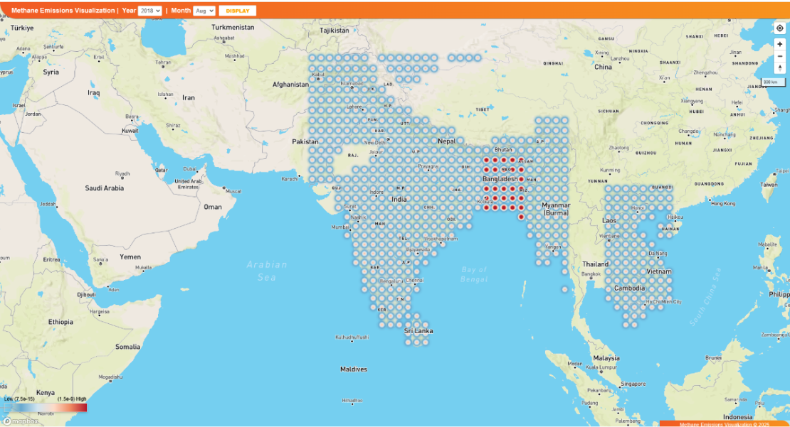
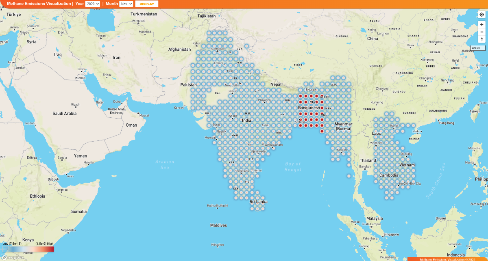
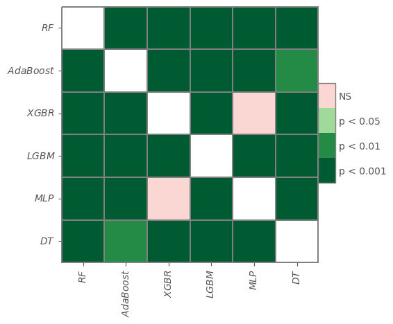

# World wide methane fluxes
.

# Methane (CH4) emissions from rice paddies
Ch4 emissions from rice paddies vary dynamically depending on rice growing stages (Figure 1 (iii)) and environmental conditions, as described below,
- The early emission peak is the first one. In this pattern,
CH4 fluxes increase after flooding for rice transplanting, as straw and/or stubble from the previous season provides the substrate for CH4 production.
CH4 emissions peak during tillering and typically decrease to near-zero levels before harvest. This group covers about 40% of all observations. This is observed in
Vietnam.
- There are two emission peaks in the second pattern. After transplanting, CH4 fluxes rise, peak during the tillering stage, and then fall. At the heading stage,
when anaerobic conditions are created by flooding and rice roots serve as substrates for the production of CH4, emissions usually show a second peak. Vietnam
is included in the 27% of total observations that fall into this category.
- There is only one late emission peak in the third pattern. In this instance, the low temperature causes low initial CH4 fluxes following transplantation. CH4
fluxes progressively increase root exudates as the growing season goes on. Due to root exudates, CH4 then peaks at the heading stage. Due to low temperatures
and pre-harvest drainage, emissions start to decline after the heading. This category includes about 24% of all observations, including those from India.
- The final pattern is distinguished by emissions that are almost continuous. After transplanting, CH4 fluxes rise but stay high due to constant flooding and high
temperatures. They then fall until draining at the end of the rice season. Approximately 8% of all observations, including India, follow this pattern.

# Table 1: The top 12 rice-producing countries in the world (milled production, 1000 metric tons)

|Country | 2018/19 | 2019/20 | 2020/21 | 2021/22 | 2022/23 | 2022/23 |
|--------|---------|---------|---------|---------|---------|---------|
|China   | 148,490 | 146,730 |148,300  |148,990  |145,946  | 145,946 |
|India   | 116,484 | 118,870 | 124,368 | 129,471 |132,000  |132,000  |
|Bangladesh | 34,909 | 35,850 | 34,600 | 35,850  | 35,850  | 36,350  |
|Indonesia  | 34,200 |34,700  | 34,500 | 34,400  | 34,600  | 34,000  |
| Vietnam   | 27,344 | 27,100 | 27,381 | 26,769  | 27,000  | 27,000  |
| Thailand  | 20,340 | 17,655 | 18,863 | 19,878  | 20,200  | 20,200  |
| Burma     | 13,200 | 12,650 | 12,600 | 12,352  | 12,500  | 12,500  |
| Philippines | 11,732 | 11,927 | 12,416 | 12,540 | 12,411 | 12,411  |
| Japan     | 7657 | 7611 | 7570 | 7636 | 7450 | 7480  |
| Brazil    | 7140 | 7602 | 8001 | 7337 | 6936 | 6800  |
| Pakistan  | 7202 | 7206 | 8420 | 9323 | 6600 | 6600  |
| Cambodia  | 5742 | 5740 | 5739 | 5771 | 5933 | 5933  |

# Table 2: Rice cultivation environment, climate, and major regions/ countries.

| Major Categories | Sub-Catrgories | Climate Description | Countries|
|------------------|----------------|---------------------|----------|
| Irrigated | With conducive temperature. With low-temperature, tropical zone. With low temperature, the temperate zone. | Warm to hot - tropics (rice all seasons) and Subtropics (double-crop summer rice) | Indonesia, Sri Lanka, Vietnam, the Philippines, south-eastern India, southern China, Bangladesh, Japan, Korean peninsula, north-eastern China, southern Brazil, southern USA|
| Rainfed Lowlands | Rainfed Shallow, suitable, drought-prone, submergence-prone deep, waterlogged.| Tropics | Cambodia, Northeast Thailand, eastern India, Indonesia, Myanmar, Nigeria |
| Upland | Suitable upland with  long growing season (LGS). Favorable upland with short growing season (SGS). Unfavorable upland with LGS. Unfavorable upland with SGS. | Tropics | South Asia, Southeast Asia, Brazilian Cerrado, western Africa, East Africa, Uganda |
| Deep Water | Deep water. Very deep water | Tropics | River deltas of South Asia and Southeast Asia, Mali |
| Tidal Wetlands | TW (Tidal Wetlands) with perennial fresh water. TW with seasonal or perennial saline water. TW with acid sulfate soils. TW with peat soils | Tropics | Vast areas near seacoasts and inland estuaries in Indonesia (Sumatra and Kalimantan), Vietnam and smaller areas in India, Bangladesh, and Thailand |

# Table 3: The atmospheric composition satellite retrievals used as input into
the CAMS reanalysis EGG4 are listed below.

| Parameter      | Satellite         | Period     | Data   |
|----------------|-------------------|------------|--------|
| CH4            | Environmental satellite (Envisat)          | 2003-01-08  - 2012-04-08     | ESACCI (SRON) v7.0|
| CH4            | MetoP-A          | 2007-07-01 - 2015-06-30       | LMD v8.3    | 
| CH4            | MetoP-B          | 2013-02-01 - continue      | LMD v8.1   |
| CH4             | Greenhouse Gases Observing satellite (GoSAT) |2009-06-01 - continue | ESACCI (SRON)|

# HP importances for the six regression models

# HP importances for the six classification models

# Correlation

# Boxplot-Bangladesh

# Boxplot-India

# SHAP-India

# SHAP-Bangladesh

# SHAP-Vietnam

# Table 3: Models and HPs for regression and classification.

| Model       | Hyperparameters (Regression)                            |  Model    | Hyperparameters (Classification)           |             
|-------------|----------------------------------------------------------|-----------|--------------------------------------------------|
| **RFR**      | criterion=‘poisson’, max_depth=2, max_samples=0.651752, min_samples_leaf=0.189317, min_samples_split=0.449878, n_estimators=23 | **RFC** | class_weight=‘balanced’, max_depth=4, max_samples=0.920910, min_samples_leaf= 0.1060876, min_samples_split=0.223397, n_estimators=43 |
| **AdaBoostR**| earning_rate=0.014532, n_estimators=110  |  **AdaBoostC** | learning_rate= 1.562151, n_estimators=48|  
| **XGBR**    | eta=0.027458, eval_metric=‘rmse’, gamma=0.771812, max_depth=5, max_leaves=5, min_child_weight=1, n_estimators=99 | **XGBC**    | eta=0.320501, eval_metric=‘auc’, gamma=0.437727, max_depth=2, max_leaves=2, min_child_weight=5, n_estimators=27 |                                                                                            |
| **LGBMR**    | feature_fraction=0.458930, learning_rate=0.082612, max_depth=1, min_data_in_leaf=2, n_estimators=18, num_leaves=28, objective=‘regression’ | **LGBMC** | class_weight=‘balanced’, feature_fraction=0.489883, learning_rate=0.614967, max_depth=5, min_data_in_leaf=82, n_estimators=81, num_leaves=34, objective=‘binary’ |
| **MLPC**  | activation=‘logistic’, alpha=0.000842, hidden_layer_sizes=14, learning_rate=‘adaptive’, learning_rate_init=0.003694, max_iter=265, momentum=0.071646, solver=‘sgd’ | **MLPR** | activation =‘tanh’,alpha=0.000544, hidden_layer_sizes=9, learning_rate=‘invscaling’, learning_rate_init=0.007015, max_iter=486, momentum=0.994338, solver=‘lbfgs’ |
| **DTR** | criterion=‘squared_error’, max_depth=4, min_samples_leaf=2, min_samples_split=12 | **DTC** | criterion=‘entropy’, max_depth=3, min_samples_leaf=9, min_samples_split=13|

# Methane emission-India, Bangladesh, Vietnam (2018, Jan)

# Methane emission-India, Bangladesh, Vietnam (2018, Aug)

# Methane emission-India, Bangladesh, Vietnam (2020, Nov)

# Methane emission- heatmap of Friedman test

